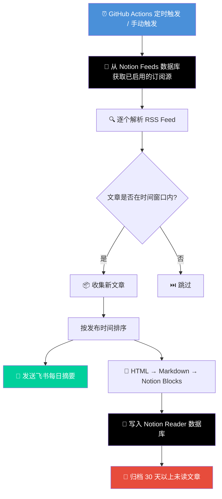

<div align="center">

# 📡 Notion RSS

**基于 Notion 的个人 RSS 阅读器，支持飞书通知推送**

[](https://www.python.org/)
[](https://developers.notion.com/)
[](https://github.com/features/actions)
[](https://www.feishu.cn/)

自动抓取 RSS 订阅源，将文章内容写入 Notion 数据库，同时推送每日摘要到飞书群。

</div>

---

## ✨ 功能特性

- **📋 RSS 订阅管理** — 在 Notion 数据库中管理所有订阅源，通过勾选框一键启用/禁用
- **🔄 自动抓取与过滤** — 定时抓取 RSS Feed，仅获取时间窗口内的新文章（默认 24 小时）
- **📝 智能内容转换** — HTML → Markdown → Notion Blocks，完整保留标题、列表、链接等格式
- **📖 Notion 阅读器** — 文章自动写入 Notion Reader 数据库，随时随地阅读
- **🔔 飞书通知** — 每日新文章摘要推送到飞书群，不错过任何更新
- **🧹 自动清理** — 自动归档 30 天以上的未读文章，保持数据库整洁
- **⚙️ GitHub Actions** — 每日定时自动运行，零维护成本

---

## 🔄 工作流程



---

## 📁 项目结构

```
notion-rss/
├── main.py              # 入口文件，编排整体流程
├── feed.py              # RSS 抓取与过滤逻辑
├── notion.py            # Notion API 交互（读取订阅源、写入文章、清理旧文章）
├── parser.py            # 内容转换（HTML → Markdown → Notion Blocks）
├── feishu.py            # 飞书 Webhook 消息推送
├── helpers.py           # 工具函数（时间差计算）
├── requirements.txt     # Python 依赖
├── .env.example         # 环境变量模板
└── .github/workflows/
    └── feed.yml         # GitHub Actions 工作流配置
```

---

## 🚀 快速开始

### 前置条件

- Python 3.12+
- Notion 账号 + [Integration Token](https://www.notion.so/my-integrations)
- 飞书群机器人 Webhook URL

### 1. 配置 Notion 数据库

你需要在 Notion 中创建两个数据库，并将它们与你的 Integration 关联。

**Feeds 数据库**（管理订阅源）：

| 属性名 | 类型 | 说明 |
|--------|------|------|
| `Title` | Title | 订阅源名称 |
| `Link` | URL | RSS Feed 地址 |
| `Enabled` | Checkbox | 是否启用该订阅源 |

**Reader 数据库**（存储文章）：

| 属性名 | 类型 | 说明 |
|--------|------|------|
| `Title` | Title | 文章标题 |
| `Link` | URL | 文章原文链接 |
| `Created At` | Created time | 创建时间（自动生成） |
| `Read` | Checkbox | 是否已读 |

### 2. 配置环境变量

```bash
cp .env.example .env
```

编辑 `.env` 文件，填入你的配置：

```env
NOTION_API_TOKEN=your_notion_api_token_here
NOTION_READER_DATABASE_ID=your_reader_database_id_here
NOTION_FEEDS_DATABASE_ID=your_feeds_database_id_here
FEISHU_WEBHOOK_URL=https://www.feishu.cn/flow/api/trigger-webhook/xxxx
RUN_FREQUENCY=86400
```

### 3. 本地运行

```bash
# 安装依赖
pip install -r requirements.txt

# 运行
python main.py
```

---

## 🤖 GitHub Actions 部署

本项目已配置 GitHub Actions，每天 UTC 5:12（北京时间 13:12）自动运行。

### 配置步骤

1. Fork 本仓库
2. 进入仓库 **Settings → Secrets and variables → Actions**
3. 添加以下 Secrets：

| Secret 名称 | 说明 |
|-------------|------|
| `NOTION_API_TOKEN` | Notion Integration Token |
| `NOTION_READER_DATABASE_ID` | Reader 数据库 ID |
| `NOTION_FEEDS_DATABASE_ID` | Feeds 数据库 ID |
| `FEISHU_WEBHOOK_URL` | 飞书 Webhook 地址 |

4. 工作流会自动按计划运行，也可以在 **Actions** 页面手动触发

---

## 📋 环境变量说明

| 变量名 | 必填 | 默认值 | 说明 |
|--------|-----|--------|------|
| `NOTION_API_TOKEN` | ✅ | — | Notion API 认证令牌 |
| `NOTION_READER_DATABASE_ID` | ✅ | — | 存储文章的 Reader 数据库 ID |
| `NOTION_FEEDS_DATABASE_ID` | ✅ | — | 管理订阅源的 Feeds 数据库 ID |
| `FEISHU_WEBHOOK_URL` | ✅ | — | 飞书机器人 Webhook 地址 |
| `RUN_FREQUENCY` | ❌ | `86400` | 抓取时间窗口（秒），默认 24 小时 |
| `CI` | ❌ | — | CI 环境标识，影响日志级别 |

---

## 🛠️ 技术栈

| 依赖 | 用途 |
|------|------|
| [feedparser](https://feedparser.readthedocs.io/) | RSS/Atom Feed 解析 |
| [requests](https://requests.readthedocs.io/) | HTTP 请求（Notion API、飞书 Webhook） |
| [markdownify](https://github.com/matthewwithanm/python-markdownify) | HTML 转 Markdown |
| [python-dotenv](https://github.com/theskumar/python-dotenv) | 环境变量管理 |
